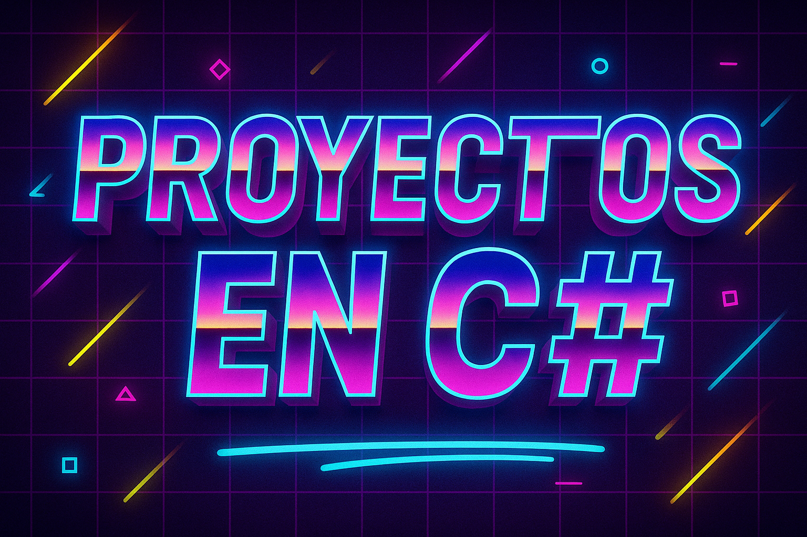

  

🖥️ **Proyectos en C# con Windows Forms (.NET)**, desarrollados en **Visual Studio** y enfocados en crear aplicaciones de escritorio que combinan **interactividad, lógica y persistencia de datos**.  

Estos proyectos buscan reforzar el **aprendizaje académico** y la **experiencia profesional**, aplicando los fundamentos de la **programación orientada a objetos**, el **manejo de interfaces gráficas (GUI)** y la integración con **bases de datos**.  

💡 En este repositorio encontrarás:  
- ⚙️ **Aplicaciones funcionales** que resuelven problemas reales y académicos.  
- 🖼️ **Interfaces gráficas interactivas** con controles de Windows Forms (botones, menús, cuadros de texto, tablas, etc.).  
- 🗄️ **Conexiones con bases de datos** (SQL Server / SQLite) para operaciones CRUD.  
- 📚 **Código organizado y comentado**, pensado tanto para estudiantes como para profesionales que quieran fortalecer sus habilidades en C#.  
- 🚀 **Buenas prácticas en .NET**, enfocadas en escalabilidad y mantenibilidad.  

🎯 **Objetivo:** Este repositorio es un espacio de práctica y experimentación, donde cada proyecto contribuye a consolidar conocimientos en C# y Windows Forms, ofreciendo una base sólida para el desarrollo de aplicaciones de escritorio profesionales.
